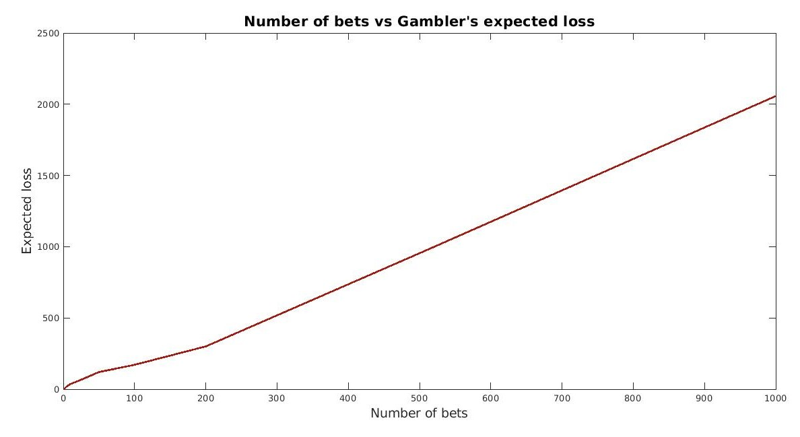

# Results
With an initial amount of 10000$ and a bet amount of 100$ my simulation gave the following results:

|N. OF BETS| EXPECTED FINAL AMOUNT ($)| EXPECTED LOSS ($)|
|---|---|---|
|1|10000|0|
|5|9980|20|
|10|9964|36|
|25|9934|66|
|50|9880|120|
|100|9829|171|
|200|9700|300|
|500|9046|954|
|1000|7943|2057|

These numbers can confirm the initial hypotesis. The fact that a gambler would try his luck with one single bet can be justified by a loss expectancy of 0$, but the table above clearly prove that by increasing the number of bets, the expected loss increases too. 

In conclusion, the correlation between these two variables is glaring, and the plot below proves definetly how ***"The house always wins!"***

 

